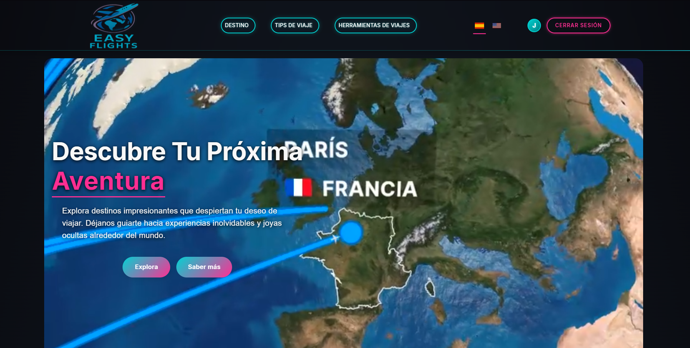

<h1>Hola 👋, Soy Javier</h1>

 Desarrollador Full-Stack con experiencia en React, JavaScript y Python. Impulsado por el aprendizaje constante, con una mentalidad de crecimiento y motivado por asumir nuevos desafíos.

## 🌐 Redes:

# 💻 Habilidades y Tecnologías:
       

# 📚 Proyectos Importantes
<h3>Easy Flights</h3>

 Web site: https://easy-flights.onrender.com

 <strong>Tecnologías usadas </strong>  
 Flask 🔸 Python 🔸 Reactjs 🔸 Bootstrap 🔸 Javascript 🔸 CSS 🔸 Render 🔸 SQLAlchemy 🔸 JWT

<strong> Detalles: </strong>  
Un proyecto que ofrece ventajas tanto a usuarios como a compañías al reguistrarse y trae consigo varias herramientas que resultan muy utiles a los usuarios como un   
planificador de vuelo o una opción para dividir los gastos de un viaje entre todos los integrantes.  

Muy orgulloso del equipo con el que he contado para este proyecto al poder lograr este resultado en apenas 4 semanas

# 📊 Estadísticas:
 
 

---

<!-- Proudly created with GPRM ( https://gprm.itsvg.in ) -->
